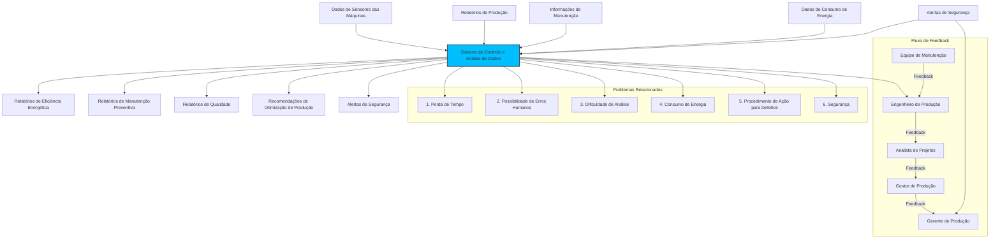
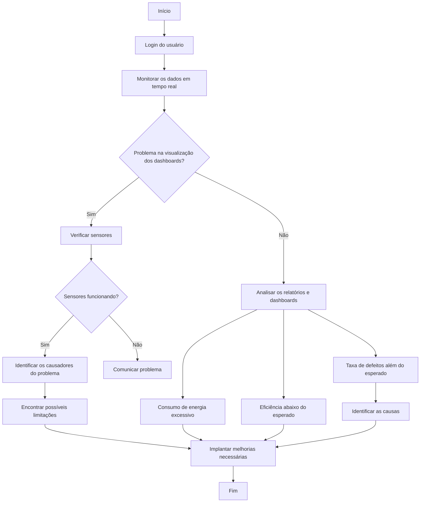
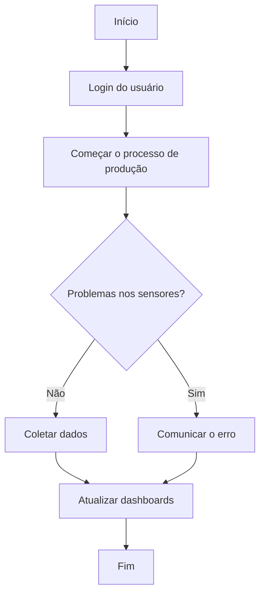
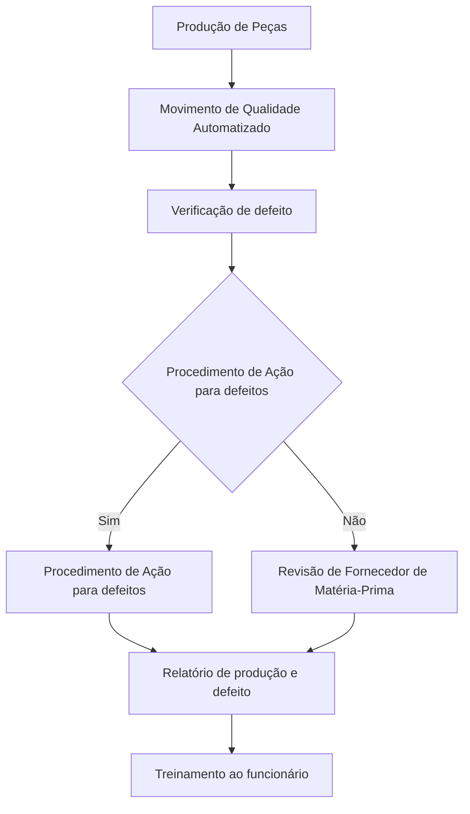

# 📃Documentos

## 📄PRD
#### 📖Introdução
O objetivo do nosso produto é proporcionar a fábrica de produção de peças para automóveis uma maior eficiência utilizando um sistema de coleta e análise de dados automatizado

#### ❓Por que implementar
A implementação do nosso produto trará a empresa muitos benefícios, pois a substituição de um sistema manual por um sistema automatizado fará com que a produtividade seja maior, assim trazendo mais oportunidades e visibilidade para seu negócio. A partir da coleta e análise de dados de maneira automatizada é possível ter uma melhor visualização da produção em tempo real, possibilitando futuras tomadas de decisões.

## ❗Problemas
#### Problemas
- Perda de tempo (o que um humano faria, uma máquina faria mais rápido)
- Possibilidade de erros humanos (humanos são falhos, com máquina os erros tendem a ser menores)
- Dificuldade de análise (existem diversas ferramentas para análise de dados como algumas bibliotecas python que facilitam análises, de forma manual é mais difícil e inificiente)
- Consumo de energia
- Procedimentos de Ação para Defeitos
- Segurança

## 📚Requisitos funcionais
1. Monitoramento em Tempo Real:

- O sistema deve monitorar os dados das máquinas em tempo real.

- Exibir dados coletados de sensores e relatar problemas de eficiência, consumo de energia e defeitos.

2. Verificação e Ação para Defeitos:

- O sistema deve verificar a presença de defeitos nos processos de produção.

- Executar procedimentos de ação corretiva em caso de defeitos, como revisão do fornecedor de matéria-prima e treinamento dos funcionários.

3. Gerenciamento de Alertas:

- Gerar alertas de segurança, manutenção preventiva e qualidade.
- Notificar os responsáveis (equipe de manutenção, analista de projetos, etc.) sobre esses alertas.

4. Relatórios e Análises:

- Produzir relatórios de eficiência energética, consumo de energia, e qualidade.
- Fornecer recomendações de otimização da produção com base nos relatórios.

5. Integração com Equipes e Sistemas de Segurança:

- O sistema deve integrar-se com a equipe de manutenção, engenheiros de produção, analistas de projetos e gestores para coordenar ações.
- Deve se conectar ao sistema de segurança para automatizar processos e respostas a alertas de segurança.

6. Treinamento de Funcionários:

- Gerar conteúdo e planos de treinamento para funcionários com base nos relatórios de produção e defeitos.

7. Gestão de Procedimentos de Manutenção:

- O sistema deve permitir o agendamento e rastreamento de procedimentos de manutenção preventiva e corretiva.
- Deve enviar notificações automáticas sobre a necessidade de manutenção baseada nos dados de uso e condição dos equipamentos.

8. Análise Preditiva:

- O sistema deve utilizar dados históricos e em tempo real para prever falhas potenciais e sugerir ações preventivas.

- Deve oferecer relatórios de análise preditiva para otimizar a eficiência da produção.

9. Integração com Sistemas Externos:

- Suporte para APIs para facilitar a comunicação com outros sistemas.

10. Gestão de Inventário:

- Controle e rastreamento de inventário de peças de reposição e outros materiais necessários para a manutenção.

## 📚Requisitos não  funcionais
1. Desempenho e Escalabilidade:

- O sistema deve ser capaz de processar dados em tempo real de várias fontes simultaneamente sem degradação de desempenho.

- Escalabilidade para acomodar o aumento de dados de novos sensores e dispositivos adicionados ao ambiente de produção.

2. Confiabilidade e Robustez:

- Deve ser confiável, garantindo alta disponibilidade e resistência a falhas.
- O sistema deve continuar funcionando mesmo com falhas parciais, como falhas de sensores individuais.

3. Segurança:

- Implementar medidas de segurança para proteger dados sensíveis coletados de sensores e informações de manutenção.

- Controle de acesso adequado para diferentes níveis de usuários, garantindo que apenas usuários autorizados possam realizar certas ações.

4. Usabilidade:

- A interface do sistema deve ser intuitiva e fácil de usar para diferentes tipos de usuários, desde técnicos de manutenção até gestores.

5. Manutenibilidade:

- O sistema deve ser fácil de manter e atualizar com o mínimo de interrupções nos serviços.

6. Compatibilidade:

- Compatibilidade com sistemas existentes de segurança e gerenciamento de produção.

- Suporte para múltiplos dispositivos e navegadores.

7. Performance de Interface:

- A interface deve responder rapidamente a comandos e atualizações, garantindo uma experiência de usuário fluida.

8. Conformidade Regulamentar:

- O sistema deve estar em conformidade com normas e regulamentos industriais e de segurança aplicáveis.

9. Backup e Recuperação de Desastres:

- Implementação de estratégias de backup regular e recuperação de desastres para proteger contra perda de dados.

10. Monitoramento de Saúde do Sistema:

- Ferramentas de monitoramento para garantir que o sistema esteja funcionando corretamente e para detectar problemas proativamente.

## 👨‍🏭Público
#### Público alvo:

- Equipe de manutenção 
- Engenheiro de produção
- Analista de projetos
- Gestor de produção
- Gerente de produção

#### Personas:

Nome: Carlos Oliveira
Idade: 45 anos
Ocupação: Gerente de Produção
Características:
Experiência: 20 anos na indústria automotiva, com foco em otimização de processos.
Desafios: Lidar com a alta variabilidade na demanda e garantir que a produção atenda aos prazos.
Necessidades: Um sistema que automatize o monitoramento das máquinas, identificando falhas potenciais antes que ocorram e que possa prever a necessidade de manutenção preventiva, reduzindo o tempo de inatividade.

Nome: Ana Paula
Idade: 32 anos
Ocupação: Engenheira de Processos
Características:
Experiência: 8 anos em engenharia de processos industriais.
Desafios: Melhorar a eficiência energética da fábrica sem comprometer a qualidade da produção.
Necessidades: Um sistema que automatize a coleta e análise de dados energéticos em tempo real, ajustando dinamicamente os parâmetros das máquinas para minimizar o consumo de energia.

Nome: Mariana Costa
Idade: 39 anos
Ocupação: Analista de Qualidade
Características:
Experiência: 12 anos na garantia de qualidade em ambientes de manufatura.
Desafios: Manter altos padrões de qualidade enquanto lida com grandes volumes de produção.
Necessidades: Um sistema que automatize a inspeção de qualidade, utilizando visão computacional para detectar defeitos nas peças, garantindo conformidade com os padrões industriais.

## 📊Diagramas
[Modelo de Método de Priorização/Diagramas](https://miro.com/app/board/uXjVKlCAZVc=/?share_link_id=511575989259)

#### Diagrama de Contexto

#### Diagrama de Atividade para Análise de Dados

#### Diagrama de Atividade para Coleta de Dados

#### Diagrama de Atividade para Ação de Defeitos
