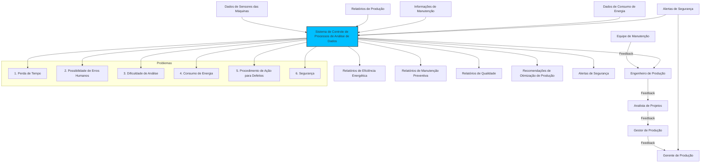

# Documentos

[Modelo de Método de Priorização](https://miro.com/app/board/uXjVKlCAZVc=/?share_link_id=511575989259)

#### Diagrama de Contexto

```mermaid
graph TD
    A[Dados de Sensores das Máquinas] --> B[Sistema de Controle de Processos de Análise de Dados]
    C[Relatórios de Produção] --> B
    D[Informações de Manutenção] --> B
    E[Dados de Consumo de Energia] --> B
    F[Alertas de Segurança] --> B
    
    B --> G[Relatórios de Eficiência Energética]
    B --> H[Relatórios de Manutenção Preventiva]
    B --> I[Relatórios de Qualidade]
    B --> J[Recomendações de Otimização de Produção]
    B --> K[Alertas de Segurança]

    L[Equipe de Manutenção] -->|Feedback| M[Engenheiro de Produção]
    M -->|Feedback| N[Analista de Projetos]
    N -->|Feedback| O[Gestor de Produção]
    O -->|Feedback| P[Gerente de Produção]

    B --> M
    F --> P
    
    %% Legendas
    B:::highlighted
    style B fill:#00BFFF,stroke:#333,stroke-width:2px

    classDef highlighted fill:#00BFFF,stroke:#333,stroke-width:2px;

    %% Problemas relacionados
    subgraph Problemas
    Q1[1. Perda de Tempo]
    Q2[2. Possibilidade de Erros Humanos]
    Q3[3. Dificuldade de Análise]
    Q4[4. Consumo de Energia]
    Q5[5. Procedimento de Ação para Defeitos]
    Q6[6. Segurança]
    end

    B --> Q1
    B --> Q2
    B --> Q3
    B --> Q4
    B --> Q5
    B --> Q6
```
