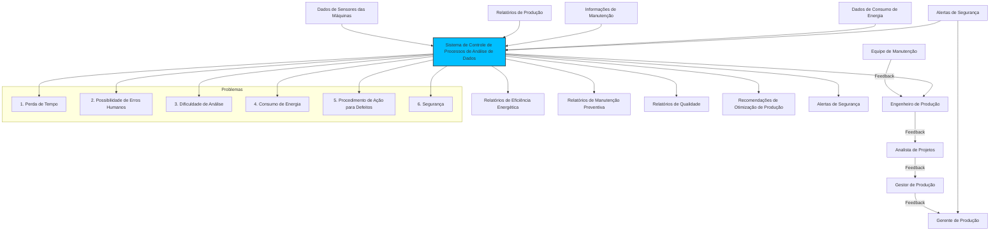
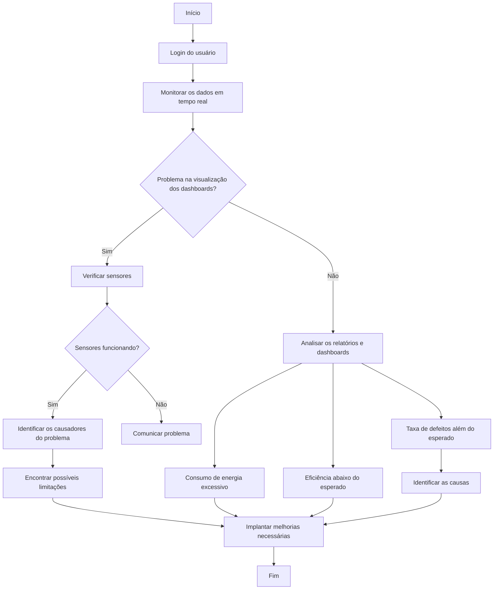
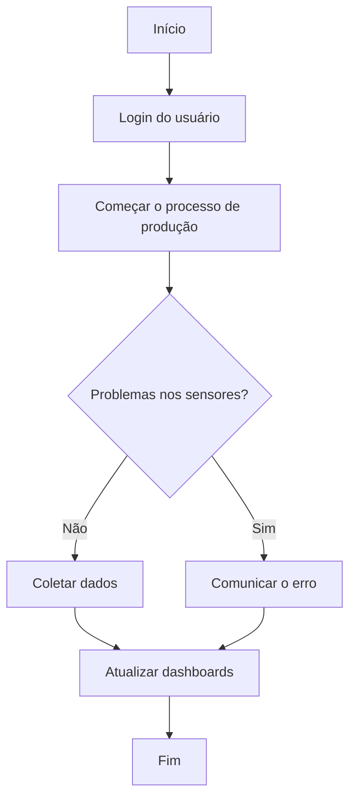
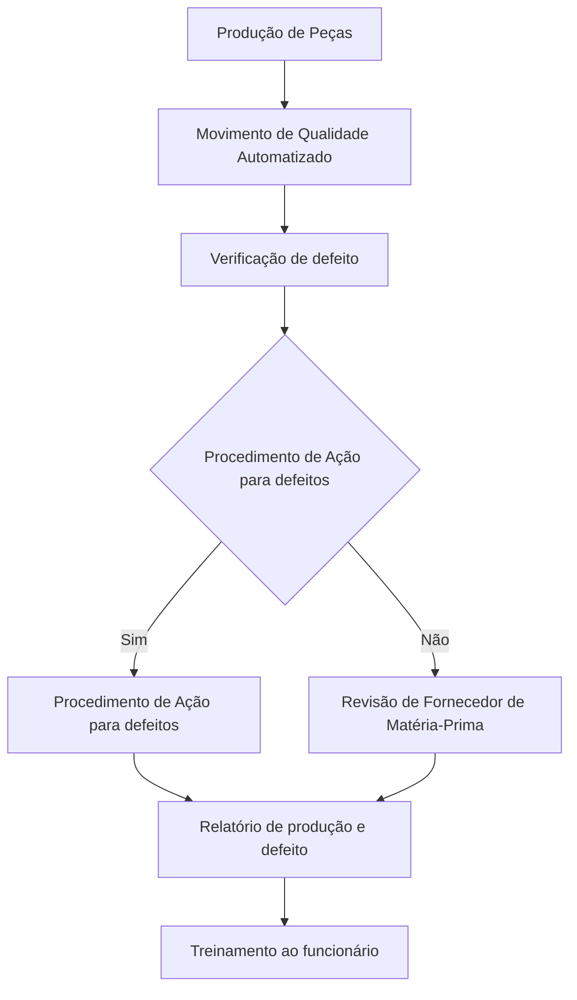

# Documentos

## PRD
#### Introdução

O objetivo do nosso produto é proporcionar a fábrica de produção de peças para automóveis uma maior eficiência utilizando um sistema de coleta e análise de dados automatizado

#### Por que implementar

A implementação do nosso produto trará a empresa muitos benefícios, pois a substituição de um sistema manual por um sistema automatizado fará com que a produtividade seja maior, assim trazendo mais oportunidades e visibilidade para seu negócio. A partir da coleta e análise de dados de maneira automatizada é possível ter uma melhor visualização da produção em tempo real, possibilitando futuras tomadas de decisões.

## Problemas
#### Problemas
- Perda de tempo (o que um humano faria, uma máquina faria mais rápido)
- Possibilidade de erros humanos (humanos são falhos, com máquina os erros tendem a ser menores)
- Dificuldade de análise (existem diversas ferramentas para análise de dados como algumas bibliotecas python que facilitam análises, de forma manual é mais difícil e inificiente)
- Consumo de energia
- Procedimentos de Ação para Defeitos
- Segurança

## Requisitos funcionais

1. Coleta automatizada de dados: As máquinas de produção devem poder coletar dados em tempo real para o sistema.

2. Análise automatizada de dados: Para melhorar a visão da produção, o sistema deve realizar análises de dados automaticamente.

3. Monitoramento automatizado de máquinas: O sistema deve monitorar as máquinas em tempo real para prevenir falhas.

4. Previsão de manutenção preventiva: O sistema deve prever a necessidade de manutenção preventiva para reduzir o tempo de inatividade.

5. Inspeção de qualidade automatizada: O sistema deve usar uma visão computacional para automatizar a inspeção de qualidade das peças, detectando defeitos.

6. Ajuste dinâmico dos parâmetros da máquina: Para maximizar o consumo de energia, o sistema deve ajustar dinamicamente os parâmetros da máquina.

## Requisitos não  funcionais

1. Eficiência: O sistema deve funcionar com mais eficiência que os métodos manuais, o que significa que o tempo necessário para coleta, análise e tomada de decisões será reduzido.

2. Precisão: Em comparação com a análise e monitoramento manuais, o sistema deve ter o menor número de erros possíveis.

3. Segurança: O sistema deve ser protegido, impedindo que pessoas não autorizadas entrem nele e garantindo que os dados coletados e analisados sejam confidenciais. 

4. Eficiência Energética: O sistema deve reduzir o consumo de energia, principalmente ajustando dinamicamente os parâmetros da máquina.

5. Escalabilidade: O sistema deve ser capaz de suportar uma maior quantidade de dados e máquinas sem perder muito desempenho.

6. Confiabilidade: O sistema deve ser confiável, com baixo tempo de inatividade e sem falhas.

## Público
#### Público alvo:

- Equipe de manutenção 
- Engenheiro de produção
- Analista de projetos
- Gestor de produção
- Gerente de produção

#### Personas:

Nome: Carlos Oliveira
Idade: 45 anos
Ocupação: Gerente de Produção
Características:
Experiência: 20 anos na indústria automotiva, com foco em otimização de processos.
Desafios: Lidar com a alta variabilidade na demanda e garantir que a produção atenda aos prazos.
Necessidades: Um sistema que automatize o monitoramento das máquinas, identificando falhas potenciais antes que ocorram e que possa prever a necessidade de manutenção preventiva, reduzindo o tempo de inatividade.

Nome: Ana Paula
Idade: 32 anos
Ocupação: Engenheira de Processos
Características:
Experiência: 8 anos em engenharia de processos industriais.
Desafios: Melhorar a eficiência energética da fábrica sem comprometer a qualidade da produção.
Necessidades: Um sistema que automatize a coleta e análise de dados energéticos em tempo real, ajustando dinamicamente os parâmetros das máquinas para minimizar o consumo de energia.

Nome: Mariana Costa
Idade: 39 anos
Ocupação: Analista de Qualidade
Características:
Experiência: 12 anos na garantia de qualidade em ambientes de manufatura.
Desafios: Manter altos padrões de qualidade enquanto lida com grandes volumes de produção.
Necessidades: Um sistema que automatize a inspeção de qualidade, utilizando visão computacional para detectar defeitos nas peças, garantindo conformidade com os padrões industriais.

## Diagramas
[Modelo de Método de Priorização](https://miro.com/app/board/uXjVKlCAZVc=/?share_link_id=511575989259)

#### Diagrama de Contexto

#### Diagrama de Atividade para Análise de Dados

#### Diagrama de Atividade para Coleta de Dados

#### Diagrama de Atividade para Ação de Defeitos

