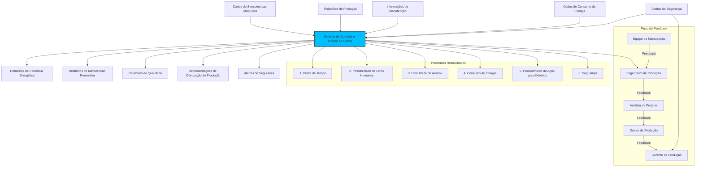
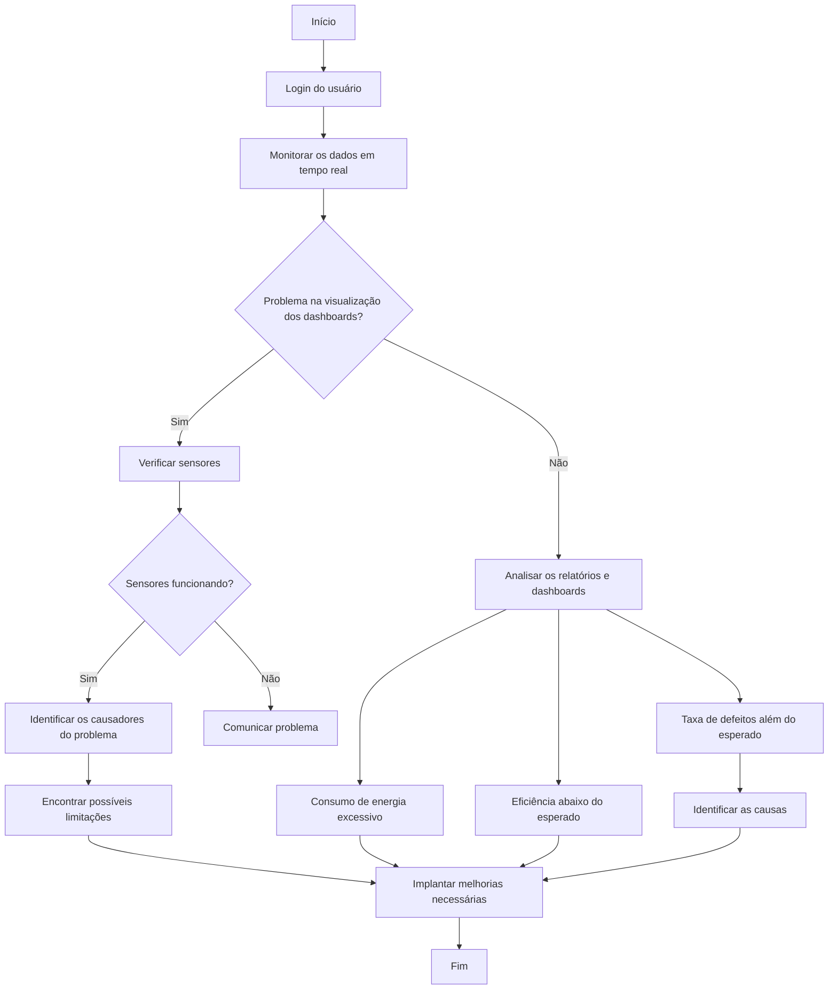
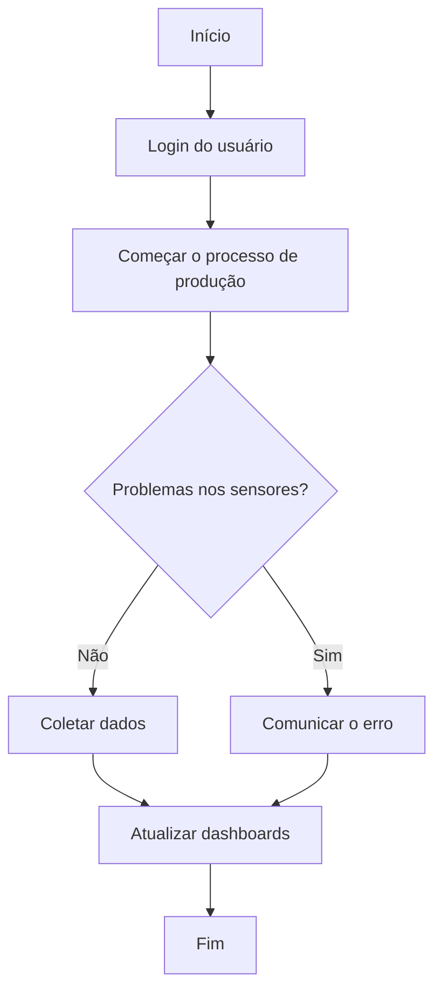
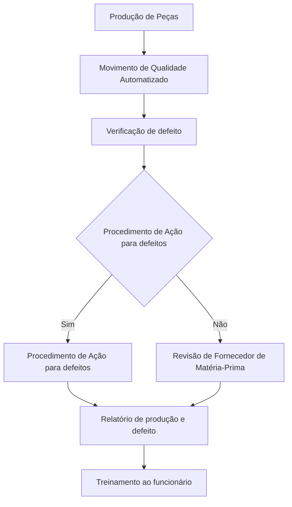

#### Diagrama de Contexto

```mermaid
graph TD
    %% Entradas para o sistema de controle
    A[Dados de Sensores das Máquinas] --> B[Sistema de Controle e Análise de Dados]
    C[Relatórios de Produção] --> B
    D[Informações de Manutenção] --> B
    E[Dados de Consumo de Energia] --> B
    F[Alertas de Segurança] --> B
    
    %% Saídas do sistema de controle
    B --> G[Relatórios de Eficiência Energética]
    B --> H[Relatórios de Manutenção Preventiva]
    B --> I[Relatórios de Qualidade]
    B --> J[Recomendações de Otimização de Produção]
    B --> K[Alertas de Segurança]

    %% Feedback entre equipes
    subgraph "Fluxo de Feedback"
        L[Equipe de Manutenção] -->|Feedback| M[Engenheiro de Produção]
        M -->|Feedback| N[Analista de Projetos]
        N -->|Feedback| O[Gestor de Produção]
        O -->|Feedback| P[Gerente de Produção]
    end

    %% Ligações adicionais
    B --> M
    F --> P

    %% Estilo e Legendas
    B:::highlighted
    classDef highlighted fill:#00BFFF,stroke:#333,stroke-width:2px;

    %% Problemas relacionados
    subgraph Problemas Relacionados
        Q1[1. Perda de Tempo]
        Q2[2. Possibilidade de Erros Humanos]
        Q3[3. Dificuldade de Análise]
        Q4[4. Consumo de Energia]
        Q5[5. Procedimento de Ação para Defeitos]
        Q6[6. Segurança]
    end

    B --> Q1
    B --> Q2
    B --> Q3
    B --> Q4
    B --> Q5
    B --> Q6
```

#### Diagrama de Atividade para Análise de Dados

```mermaid
graph TD
  A[Início] --> B[Login do usuário]
  B --> C[Monitorar os dados em tempo real]
  C --> D{Problema na visualização dos dashboards?}
  D -->|Sim| E[Verificar sensores]
  E --> F{Sensores funcionando?}
  F -->|Sim| G[Identificar os causadores do problema]
  G --> H[Encontrar possíveis limitações]
  H --> I[Implantar melhorias necessárias]
  F -->|Não| J[Comunicar problema]
  D -->|Não| K[Analisar os relatórios e dashboards]
  K --> L[Consumo de energia excessivo]
  K --> M[Eficiência abaixo do esperado]
  K --> N[Taxa de defeitos além do esperado]
  L --> I
  M --> I
  N --> O[Identificar as causas]
  O --> I
  I --> P[Fim]
```

#### Diagrama de Atividade para Coleta de Dados

```mermaid
graph TD
  A1[Início] --> B1[Login do usuário]
  B1 --> C1[Começar o processo de produção]
  C1 --> D1{Problemas nos sensores?}
  D1 -->|Sim| E1[Comunicar o erro]
  D1 -->|Não| F1[Coletar dados]
  F1 --> G1[Atualizar dashboards]
  E1 --> G1
  G1 --> H1[Fim]
```

#### Diagrama de Atividade para Ação de Defeitos

```mermaid
graph TD
  A[Produção de Peças] --> B[Movimento de Qualidade Automatizado]
  B --> C[Verificação de defeito]
  C --> D{Procedimento de Ação para defeitos}
  D -->|Sim| E[Procedimento de Ação para defeitos]
  D -->|Não| F[Revisão de Fornecedor de Matéria-Prima]
  E --> G[Relatório de produção e defeito]
  G --> H[Treinamento ao funcionário]
  F --> G
```